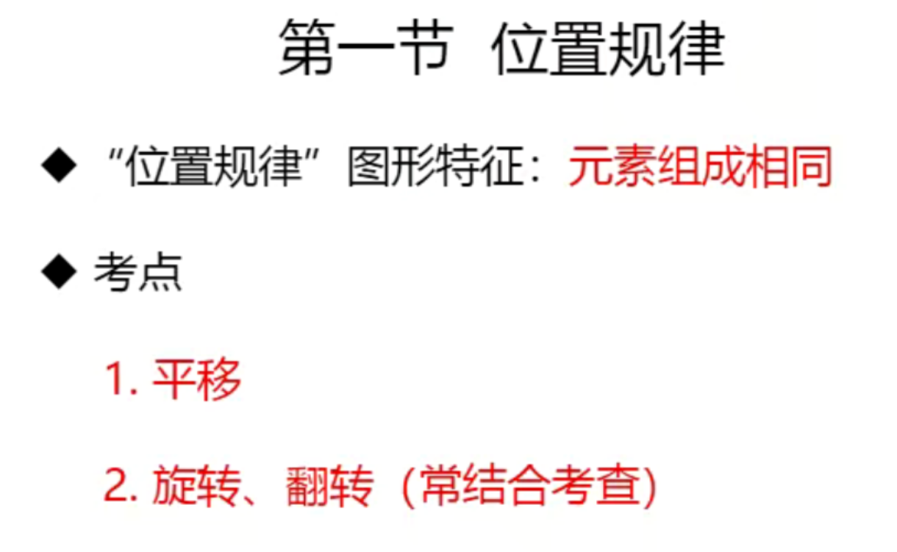
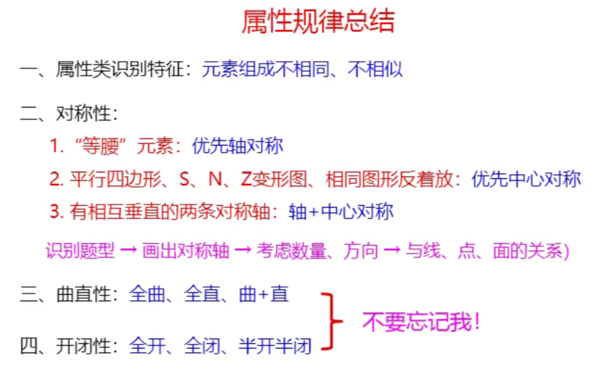
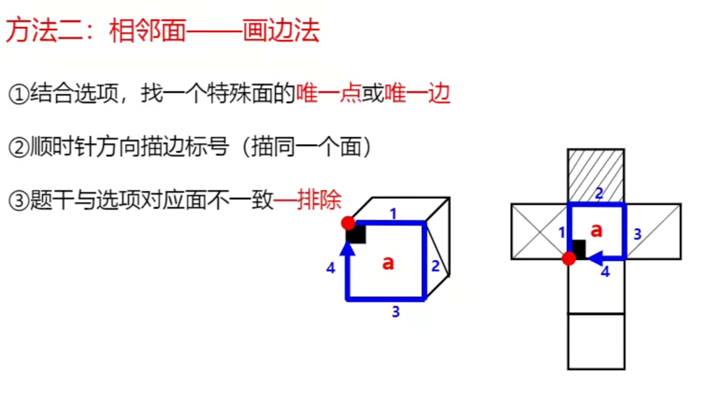
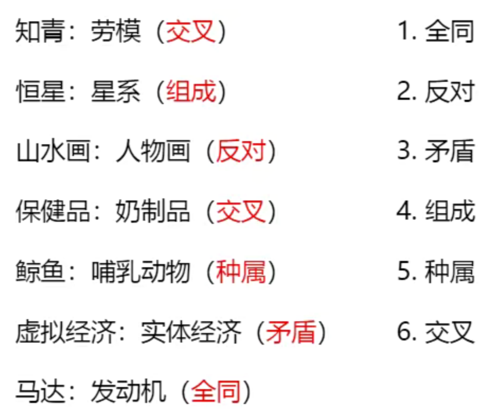
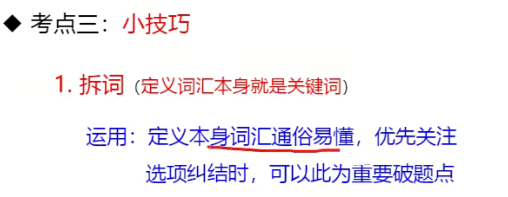
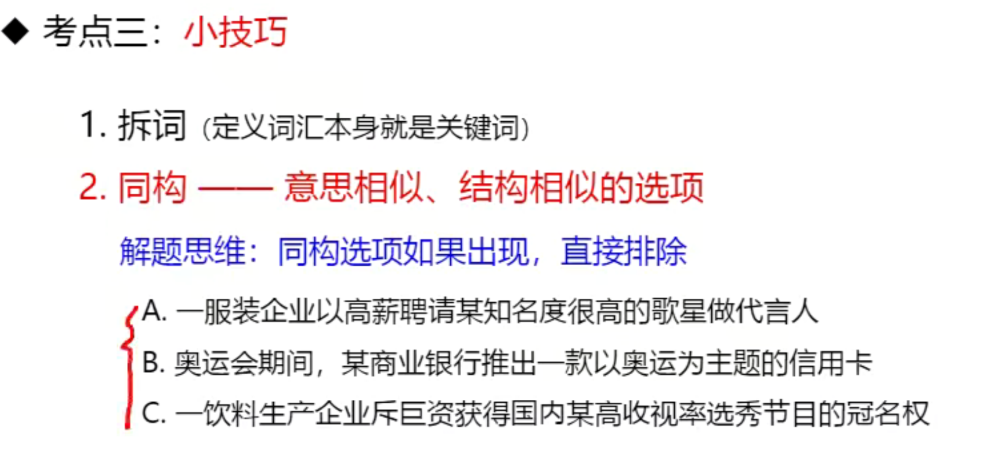

# 1 图像推理
- 10道题
## 1.1 图像推理的出题形式
---

注：空间类的不常考，把基础打牢之后再学学霸养成课
## 1.2 图形推理的考点
---

注：识别图形特征即辨别属于图形推理的哪一个类别
### 1.2.1 位置规律

### 1.2.2 样式规律

重点是求异，找1-2根选项验证，对比选项找不同

### 1.2.3 属性规律

国考里面最喜欢考对称性

`对称轴的题目特征` 等边三角形（三足鼎立），一定要把对称轴画出来。国考中`对称轴与点、线、面的关系`常考。

### 1.2.4 特殊规律

`考点二` `功能元素`
`题目特征` 每幅图中都出现小黑点、小白点、箭头等小元素。
### 1.2.5 数量规律

最常考的是面

图中分别对应1，0，1个面
白色的才是面，黑色的不是面

封闭面明显、明显被切割的时候优先数面

- 面的数量相同时，不能直接得出结论，要把所有选项看完，如果唯一则选择，如果不唯一，则要考虑面的细化。
- 不能数面的奇数和偶数，因为这样随机性太大，可以是3和4这种确定的。  
- 数量特征明显，整体面数无规律——考虑面的细化

- 只要线不拐弯，就是一条线； 没有明显拐带你就是一条曲线。 
- 单一直线/曲线是指和其他没有连接
- 单一直线优先数直线；单一曲线，优先数曲线。

`笔画数必考`

注：
- 端点也是奇点，不要忘记数
- 奇点的个数一定是偶数个

- 若图形存在多个部分，则每个部分的笔画数单独算，再相加
- 给一个图形加一个框或者去掉一个框，笔画数不变。

- 端点不算交点
- 切点是高频考点
 
 
 
 - 先考虑笔画特征，再考虑数点

### 1.2.6 空间重构

- 相对面同时出现一定要排除

- 简单的题公共边和公共点可能能做，复杂的用画边法。
- 这一块有8道题，剩下的2道题在学霸养成课中。

# 2 类比推理
---
- 10道题，8道出在逻辑关系。

- 常考关系

- 主要是集中在逻辑关系
## 2.1 语义关系

- 考试中常见的是成语的考察

- 只要两个词语是相近的，我们就认为是近义词，我们不对成语的做深究，这点要区别于言语。

- 比喻和象征不需要做区分
 

- 马大哈不能比喻粗心，比喻的是粗心的人
## 2.2 逻辑关系

- 全同是指一个食物两个名字
- a/b,a是被除数，分子；b是除数，分母；a-b,a是被减数，bs是减数

-冬装和夏装是并列关系，T恤属于夏装；植物油和动物油是并列关系，牛油属于动物油；亲情和友情是并列关系。

- 功能上是并列的，二级辨析看顺序。例如：书信、短信、微信。
- 病毒是没有细胞结构的，DNA和RNA不能共存，细菌和病毒是两种微生物。
- 电话包括手机

- 区分种属和组成：能单独用`是`造句子且造的通顺的是种属关系；两个词都是地点，一般是组成关系。
- 一般出现动物、xx科、xx木、xx纲都是种属关系。
- 花椰菜和紫甘蓝属于十字花科。
- 蚁后和工蚁是并列关系。

- 能造四个句子的是交叉关系
`交叉关系非常重要`
- 并列关系造第一句话的时候一般就不通顺了；种属关系一般造第四句才会不通顺。
- 植物包括草本植物和木本植物，木本植物包括乔木（高大）和灌木（矮小）。

- 以上都是交叉关系

- 太阳星系是星系
- 钝角三角形和等边三角形不是并列的，钝角三角形和锐角三角形是并列的。

- 工艺常考的二级辨析：区分是物理工艺还是化学工艺。
- 功能常考的二级辨析：区分主要功能和次要功能，脑子里第一个反应到的是主要功能。
- 属性常考的二级辨析：区分必然属性和或然属性。
- 时间顺序常考的二级辨析：区分主体是否一致。
- 因果常考的二级辨析：区分原因是自然还是人工；结果是积极还是消极。
- 时间顺序和因果区分：因果可以用导致造句。

- 月球是椭圆的球体。
- 先有公司上市，后才能有股价。
## 2.3 语义关系

- 通常在语义关系和逻辑关系找不到答案的情况下，再考虑语法关系。
## 2.4 拆分思维

# 3 定义判断
---
 - 国考考10道题，一般做对8道没问题，市考能做对
6、7道。

- 做题的时候一定要把四个选项全部看完，对比择优。

- 题目比较难的时候是因为出题不完美。

## 3.1 读的准

- 题干种主客体是企业、银行；选项中主体是王明，是个人，与企业不符。

- 一般提到局的都是行政机关。
- 多个主客体，一般会考察。

- 后面的内容要重点看。
- 出现或满足一个就可以了。
- 出现相同、不同、差异、分别大概率会考。
- 结果出现积极、消极，大概率会考。
- 原理效应类，重点关注应用，结果好坏很重要。
- 前提条件重点看。

- 不是每个词都能看懂，看到一些解释说明都是大白话，重点看就可以了。
## 3.2 读的快

- 非职务本身就是关键词，这种时候拆词就可以了。
 
 
 - 同构的风险比较大，不会做的时候再用。 
 - 图形类比大量刷题，定义判断精刷题（国考、浙江18-22、山东、四川下半年、北京、江苏）。
 # 4 逻辑判断
 - 10道题
 ---
 ## 4.1 翻译推理

- 前面三部分在方法精讲，后面三部分在学霸养成课。最后一个部分考的特别少。
- 翻译推理和组合排列要背；论证要理解，占比大。

- 这是逻辑题，要用规则做题，不能用日常生活中的习惯去理解。
- 先把题干翻译成公式，再推理。

- 题干中既有翻译，又有确定信息的话，从确定信息开始推。

 

- A和B至多一个  -A或-B 用否定的思想去看 ~(A^B)
## 4.2 组合排列

- 图中的题目判定不好。题干给出一组对象和几组相关信息，要求把对象和信息进行匹配。

- 题干条件确定：题目中的关系能判断真假；选项信息充分：甲乙丙的信息都给了。
- 丙比东京人年龄大，说明丙不来自东京，排除B；甲和巴黎人不同岁，说明甲不来自巴黎，排除A；选C。 
- 最值是重中之重。
 
- 组合排列只有对与不对，没有好与不好，不需要比较选项。
- 一般顺序代入会比较快。

- B 但是只能用于这种题型。

 - 假设法是应用最少的方法。应用：找到最大信息，然后假设最大信息成立和不成立两种情况。
 - 考国考的行政执行、地市级、江苏考材料题，副省级不考材料题。

## 4.3 逻辑论证

- 选项中出现论证一般就是正确答案。

- 反对者的观点是1。2是理由，是论据。

- 第3句是论点。总结性的句子是论点。

### 4.3.1  加强题型

- 解释的强度大于举例。
- 论点论据一致是指关键词一致。 
- 注意同义替换词， 
- 权威专家不一定对，小报新闻不一定错。权威专家一般是一个典型的错误选项。

- 因此后面是论点，前面是论据。
吧

- 如果选项中出现了论点推论据和论据推论点都和论证有关，优先选择论据推论点。

- 没有它不行，那么就是必要条件，没有必要条件，论点不成立。

- 提问方式为前提、假设、加强论证时，先考虑搭桥，不行再考虑必要条件，搭桥也是必要条件的一种，搭桥和必要条件都强于论据。
- 非搭桥形式的必要条件题目比较少。

- 不能加强采用排除法。
- 必要条件和搭桥是最强的，解释原因次之，举例子最弱。
### 4.3.2 削弱题型

- 直接否的强度大于举例否
- 否定论点是力度最强，考试最多；否论点有三种形式：直接否、因果倒置、举例子。因果倒置是一种特殊的直接否，强度一样。。
- 举例子在加强里面是最弱的，在削弱里面是最强的。

- 不明显和很有限都是对论点的否定，不要因为很有限很委婉就不选。
- 图片中标红部分都是干扰项，都是错误的。

- 愚人节一出现，一般就是错误选项。这是个洋节。

- 拆桥之间没有力度比较。

- 论证题都要根据题干来分析，不能主观臆断，题干没说的那我们也是不知道，一定要防止选项中的某些常识，如果题干中没有提及，那我们也不知道。比如，老师对训练质量有什么影响，题干没说，我们也不知道，不能加入自己额外的判断。
- 题干的论据在说一种物质，这种物质里面含有一种成分，吃这个就特别棒，削弱这个论点的话，一般就是这个成分含量极少或者这个物质要吃的极多。

- 对策项一般不选。

- B是他因削弱。他因削弱必须是在原因1的基础上，增加另一个`同时存在`的能导致相同结果的原因2。选项要么直接给出两个原因，要么是两个原因时间重合，例如，吃了夜市拉肚子，也吃了剩菜。
 - 削弱力度：因果倒置、否定论点排第一位；拆桥第二位；否定论据第三位；他因削弱第四位。

